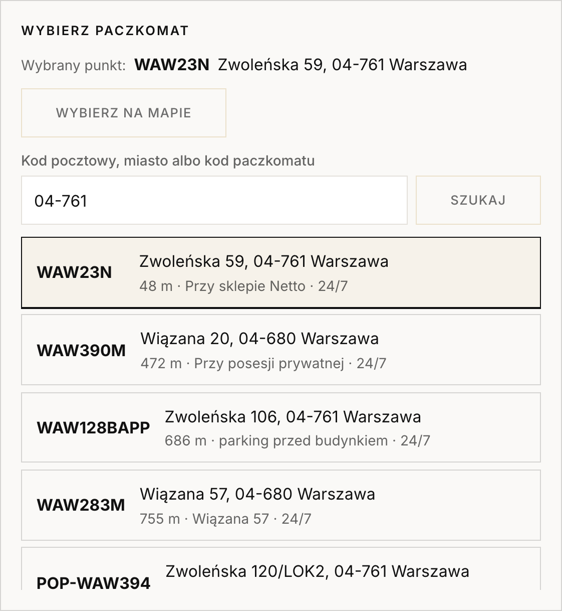
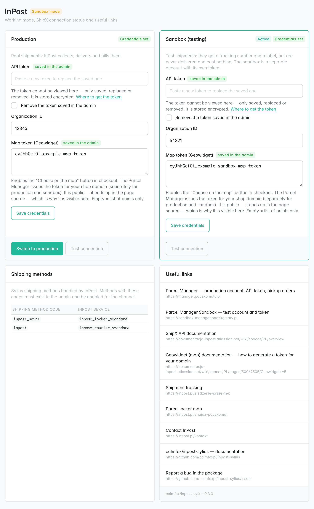
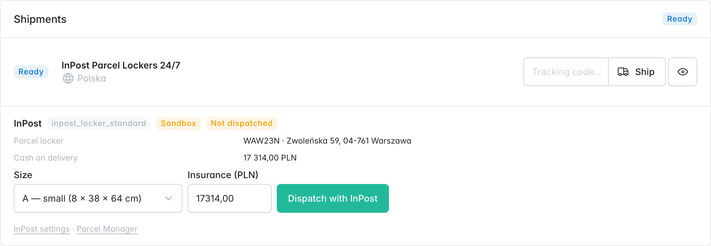
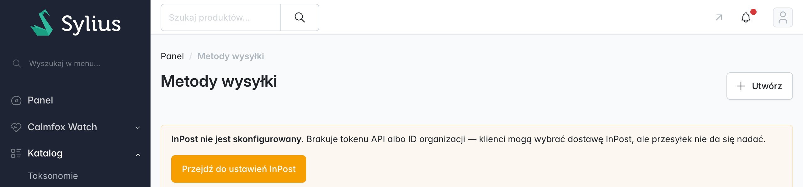

# calmfox/inpost-sylius

InPost (ShipX) for Sylius 2. Parcel lockers and courier from a single account, with no changes to your shop's entities.

[Wersja polska](README.pl.md)

- **Checkout:** the customer picks a parcel locker on the official InPost map (Geowidget v5) or from a list of the nearest points (by postcode, city or locker code). The map script loads only when the customer opens it; the list works with no token at all. No webpack.
- **Admin:** on the order page, below the shipments — "Dispatch with InPost" (locker size or parcel dimensions, insurance suggested from the order total, cash on delivery when the order is paid on delivery), status, tracking number and the label PDF straight from InPost.
- **Settings in the admin:** Configuration → InPost holds the credentials of the production and the sandbox account (the token field is write-only and stored encrypted), switches between the two, tests the connection and lists the links you need. Every shipment remembers the mode it was created in.
- **Data:** one table, `calmfox_inpost_shipment`, linked to the Sylius shipment. The tracking number is also copied to the shipment's `tracking` field, so the "shipped" e-mail and the customer account see it.

## Screenshots

**Checkout — choosing a parcel locker** (list of nearest points plus the map button; styled by the shop's theme):



**Admin — Configuration → InPost** (credentials for production and sandbox, mode switch, connection test, links):



**Admin — order page** (dispatch, status, label):



**Admin — shipping methods** (warning with a link when the active mode has no credentials):



## Requirements

PHP 8.2+, Sylius 2.x, Symfony 6.4 / 7.x, Doctrine ORM. An InPost account with ShipX API access.

## Installation

```bash
composer require calmfox/inpost-sylius
```

`config/bundles.php`:

```php
Calmfox\InPostBundle\CalmfoxInPostBundle::class => ['all' => true],
```

`config/routes/calmfox_inpost.yaml`:

```yaml
calmfox_inpost_shop:
    resource: '@CalmfoxInPostBundle/config/routes/shop.yaml'

calmfox_inpost_admin:
    resource: '@CalmfoxInPostBundle/config/routes/admin.yaml'
    prefix: '/%sylius_admin.path_name%'
```

`config/packages/calmfox_inpost.yaml` — only the method map is required; credentials can be entered in the admin instead:

```yaml
calmfox_inpost:
    # Optional. Anything saved in the admin (Configuration → InPost) wins over these values.
    api_token: '%env(INPOST_API_TOKEN)%'
    organization_id: '%env(INPOST_ORGANIZATION_ID)%'
    sandbox_api_token: '%env(INPOST_SANDBOX_API_TOKEN)%'
    sandbox_organization_id: '%env(INPOST_SANDBOX_ORGANIZATION_ID)%'
    methods:
        inpost_point: inpost_locker_standard   # Sylius shipping method code → ShipX service
        inpost: inpost_courier_standard
```

Table and assets:

```bash
bin/console doctrine:migrations:diff && bin/console doctrine:migrations:migrate
bin/console assets:install
```

Finally, create shipping methods in the Sylius admin with the codes from the `methods` map, enable them for your channel, and enter the account credentials under **Configuration → InPost** (until you do, the shipping methods screens show a warning with a link there). That is all — entity mapping and template placement (Twig Hooks) are wired by the bundle itself.

## Configuration

| Key | Default | Meaning |
|---|---|---|
| `api_token`, `organization_id` | empty | ShipX account credentials (Parcel Manager → My account → API). Fallback for what is saved in the admin. |
| `sandbox_api_token`, `sandbox_organization_id` | empty | Credentials of the separate sandbox account. Same fallback rule. |
| `geowidget_token`, `sandbox_geowidget_token` | empty | Map tokens, fallback for the admin fields. Empty = list only. |
| `geowidget_config` | `parcelcollect` | Which points the map shows. |
| `sandbox` | `false` | Starting mode. Applies until someone switches the mode in the admin (Configuration → InPost); after that the admin choice wins. |
| `methods` | `inpost_point`, `inpost` | Shipping method code → ShipX service. `inpost_locker_*` services require a pickup point. |
| `sending_method` | `dispatch_order` | How the parcel reaches InPost: `dispatch_order` (courier pickup), `parcel_locker` (you drop it at a locker), `pop`, `any_point`, `branch`. |
| `locker_template` | `small` | Size suggested when dispatching: `small` (A), `medium` (B), `large` (C). |
| `courier_parcel` | 400×300×150 mm, 2 kg | Dimensions and weight suggested for courier shipments. |
| `insurance.mode` | `order_total` | `order_total` — insure for the order value; `none` — no insurance. |
| `insurance.max_amount` | `null` | Insurance cap in minor units. Cut off more expensive orders with the built-in "order total ≤" shipping method rule. |
| `cod_payment_methods` | `[cash_on_delivery]` | Payment method codes that mean cash on delivery. COD equals the order total; insurance is raised to at least the COD amount. |
| `points_cache_ttl` | `900` | Seconds to keep point search results in `cache.app`. |

## Credentials

Enter them in the admin, **Configuration → InPost**, separately for production and sandbox. The token field is **write-only**: you can save, replace or remove a token, but no page ever shows it back — the screen only says whether a token is set and where it comes from (admin or shop configuration). In the database the token is encrypted (libsodium secretbox) with a key derived from the application secret (`APP_SECRET`), so database dumps and backups do not leak it. If you rotate `APP_SECRET`, saved tokens stop decrypting and the screen shows them as missing — paste them again.

Prefer secrets outside the database? Leave the admin fields empty and set the configuration keys from environment variables; they are used whenever the admin has no value. Each field is resolved on its own, so the organization ID can come from configuration while the token comes from the admin.

## Map (Geowidget)

Paste a Geowidget token under **Configuration → InPost** and the shipping step gets a **"Choose on the map"** button that opens InPost's official Geowidget v5 in a dialog. The Parcel Manager issues the token **for your shop's domain**, separately for production and sandbox, and each environment has its own widget host — so the map follows the shop's mode, and a token from one environment does not work in the other. With no token for the current mode the button is simply absent and the list of nearest points remains.

The widget's script and stylesheet are loaded from InPost only after the customer clicks the button, never on other pages. The Geowidget token is public by nature (it ends up in the page source), so unlike the ShipX token it is shown in the admin and stored as plain text. If your shop sends a Content-Security-Policy, allow `geowidget.inpost.pl` (and `sandbox-easy-geowidget-sdk.easypack24.net` for sandbox) for scripts, styles and connections. Config key `geowidget_config` picks the set of points: `parcelcollect` (default), `parcelcollect247`, `parcelcollectpayment`, `parcelsend`.

## Sandbox

InPost runs a full test environment: shipments get a tracking number and a label PDF, but are never collected and cost nothing. It is a **separate account with its own token and organization ID** — create it in the [sandbox Parcel Manager](https://sandbox-manager.paczkomaty.pl), save its token and organization ID in the Sandbox card under **Configuration → InPost**, then click **Switch to sandbox**. The same screen has a "Test connection" button that also tells you when the account lacks a service your shipping methods use.

Switching affects new shipments only. A shipment dispatched in the sandbox keeps talking to the sandbox (status, label) after you go back to production, its sandbox tracking number is never copied to the Sylius shipment, and the order page marks it with a "Sandbox" badge. The list of parcel lockers in checkout always comes from the production points API — the sandbox shares the same points.

## How it works

**Point selection** is a hidden field of the shipping step form (`ShipmentType`), not a separate AJAX call. A missing point on a locker method is a regular form error; nothing disables buttons in JavaScript. The point is verified against InPost's public points API — if that API is down, the shop accepts the code from the list and keeps selling. A second guard (`PointSelected`, group `sylius_checkout_complete`) covers the case where Sylius switched the method on its own after a cart change.

**Phone** must be a Polish mobile number — InPost sends the pickup code to it. The bundle normalizes the notation (`+48 605-203-478` → `605203478`) and rejects numbers ShipX would refuse already at the shipping step.

**Dispatch** is synchronous: the operator clicks, ShipX answers within a second, and validation errors come back readable (`receiver.phone: invalid`). The tracking number appears once ShipX buys the offer — the bundle waits a few seconds for it; after that there is a "Refresh status" button and a cron-friendly command:

```bash
bin/console calmfox:inpost:sync
```

To check the setup from the command line — mode, where each account's credentials come from, whether ShipX accepts them and whether the account has the services your shipping methods use (no secrets are printed):

```bash
bin/console calmfox:inpost:status
```

**Look** — `public/inpost.css` is neutral. Adjust it with `--calmfox-inpost-border`, `--calmfox-inpost-accent`, `--calmfox-inpost-muted`, or override the `.calmfox-inpost__*` classes. Templates: `@CalmfoxInPost/shop/point_picker.html.twig`, `@CalmfoxInPost/admin/shipments.html.twig`. Translations ship in Polish and English.

## Useful links

The same list is shown in the admin under Configuration → InPost.

| | |
|---|---|
| Parcel Manager — production account, API token, pickup orders | https://manager.paczkomaty.pl |
| Parcel Manager Sandbox — test account and token | https://sandbox-manager.paczkomaty.pl |
| ShipX API documentation | https://dokumentacja-inpost.atlassian.net/wiki/spaces/PL/overview |
| Geowidget (map) documentation — generating a token for your domain | https://dokumentacja-inpost.atlassian.net/wiki/spaces/PL/pages/50069505/Geowidget+v5 |
| Shipment tracking | https://inpost.pl/sledzenie-przesylek |
| Parcel locker map | https://inpost.pl/znajdz-paczkomat |
| Contact InPost | https://inpost.pl/kontakt |
| Report a bug in this package | https://github.com/calmfoxpl/inpost-sylius/issues |

## What it does not do

Courier pickup orders, returns and price lists — those live in InPost's Parcel Manager.

## Tests

```bash
vendor/bin/phpunit
```

The core (`src/Core`) does not depend on Symfony or Sylius. API client tests use `MockHttpClient` — no test talks to InPost.

## License

MIT © Calmfox
